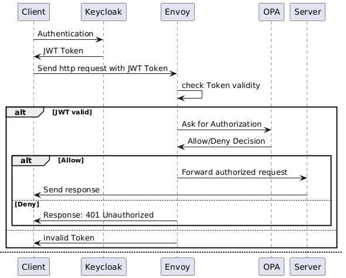

# General Access Control with Envoy and OPA

This example shows how to put access control in front of any HTTP application without adding authorization code to the application itself.

The application only receives requests after:

1. Envoy has verified the incoming bearer token against an OpenID Connect issuer.
2. Envoy has asked OPA whether the verified request is allowed.
3. OPA has matched the request method, path and token roles against the configured policy data.



## Components

- `envoy`: The public reverse proxy on http://localhost:10000. It validates JWTs and calls OPA for authorization.
- `opa-envoy`: OPA with the Envoy external authorization gRPC plugin enabled.
- `keycloak`: A demo OpenID Connect identity provider on http://localhost:8080.
- `app`: A replaceable demo application. In real deployments this is the service you want to protect.

## Run the Example

Start the stack from this directory:

```bash
docker compose up
```

The demo Keycloak realm is imported automatically. It provides these test users:

| User | Password | Role | Default access |
|------|----------|------|----------------|
| `alice` | `alice` | `reader` | `GET` and `HEAD` |
| `bob` | `bob` | `writer` | `GET`, `HEAD`, `POST`, `PUT` and `PATCH` |
| `admin` | `admin` | `admin` | All methods and `/admin` paths |

Protected requests without a valid token are rejected by Envoy with `401 Unauthorized`. Requests with a valid token but insufficient roles are rejected by OPA with `403 Forbidden`.

### PowerShell Smoke Test

Get a reader token:

```powershell
$token = (Invoke-RestMethod `
  -Method Post `
  -Uri "http://localhost:8080/realms/access-control-demo/protocol/openid-connect/token" `
  -Body @{
    grant_type = "password"
    client_id = "access-control-demo-client"
    client_secret = "change-me"
    username = "alice"
    password = "alice"
  }).access_token
```

Call the protected application through Envoy:

```powershell
Invoke-WebRequest `
  -Uri "http://localhost:10000/" `
  -Headers @{ Authorization = "Bearer $token" }
```

Try an admin path with the reader token:

```powershell
Invoke-WebRequest `
  -Uri "http://localhost:10000/admin" `
  -Headers @{ Authorization = "Bearer $token" }
```

The last request should be denied with `403 Forbidden`.

## Adapting It to Any Application

1. Replace the `app` service in `compose.yaml` with your application, or update the `app` cluster in `envoy.yaml` to point to an existing host and port.
2. Update the OIDC settings in `envoy.yaml`:
   - `issuer`
   - `audiences`
   - `remote_jwks.http_uri.uri`
   - the `keycloak` cluster if your JWKS endpoint is not the demo Keycloak service
3. Update `keycloak/realm.json` only for the local demo identity provider, or replace Keycloak with your real identity provider.
4. Edit `policies/data.json` to describe the application's protected path prefixes, methods and required roles.

The Rego policy in `policies/policy.rego` is intentionally generic. Most application-specific changes should be made in `policies/data.json`.

## Policy Model

OPA evaluates the most specific path prefix that matches the request. For example, `/admin` rules override the catch-all `/` rules.

Rules are written as data:

```json
{
  "path_prefix": "/admin",
  "methods": ["GET", "POST", "PUT", "PATCH", "DELETE"],
  "roles": ["admin"]
}
```

The policy reads roles from common JWT claim shapes:

- Keycloak realm roles: `realm_access.roles`
- Generic role arrays: `roles`
- Generic group arrays: `groups`
- Space separated OAuth scopes: `scope`

Envoy validates the token before OPA sees the request. OPA receives the verified JWT payload via Envoy dynamic metadata, so the policy does not decode or trust raw bearer tokens directly.

